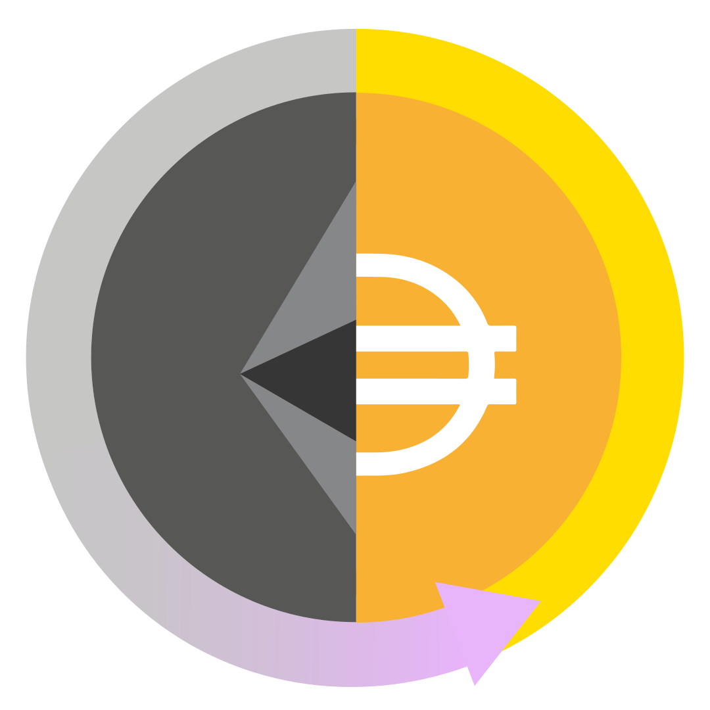

# Gasless DAI Token Transfer And Conversion

This project enables you to transfer or convert your DAI tokens without having any ETH in your wallet.
Leveraging the Gas Station Network (GSN), this solution enables gasless transactions by relying on relayers, who are compensated directly with DAI. The core of this functionality is encapsulated in the *PermitERC20UniswapPaymaster* contract, allowing relayers to collect DAI, swap it for ETH on Uniswap, and cover the associated gas fees.
While it is fully working it's important to note that the project remains experimental, has not undergone auditing and is not yet deemed production-ready!
The user interface was built using *ViteJS* (React) and *ethersjs*.

[Try it now!](https://mute-dawn-0219.on.fleek.co/)

## How to use
Either use our pre-deployed [web UI](https://mute-dawn-0219.on.fleek.co/) or run the interface locally on your machine.
Get some GoerliETH from your preferred faucet, along with Goerli DAI from Uniswap (be sure to get the [correct](https://goerli.etherscan.io/address/0x11fE4B6AE13d2a6055C8D9cF65c55bac32B5d844) ones!).
Connect your Metamask account to the application, and you're set to execute your first gasless swap!

## Active deployment
Currently deployed **ONLY** on **Goerli**.
The Swapper contract available in *contracts* folder.
ABI of Swapper available in *assets* folder or [Goerli Etherscan](https://goerli.etherscan.io/address/0xeA3406bb7D2EC5A8b05A3700CF77178f95738037#code).

## Potential use cases and limits
Originally designed for DAI, its functionality could be extended to any token that implements a permit function.
No, USDT does not work as it does not have any permit mechanic.

## How it works
Users have the option to either transfer DAI to another address or swap DAI for ETH on Uniswap. 
The two main functions are:
- **transferDAI**: presents the permit signed by the user to the DAI contract and transfers the funds to the provided recipient address 
- **exactOutputSwapDAIforETH**: implements Uniswap's exactOutputSingleSwap function, the user provides a signed permit, and once the Swapper contract receives the funds, it executes the swap. Any excess DAI tokens are returned to the user, and the obtained wETH is unwrapped to ETH before being sent back.

There is one more function in the UI, **capture**. It calls GSN's *Capture The Flag* demo contract. It is there to allow a user to test only a gasless transaction in case he does not possess any DAI tokens.

### Key features
This project leverages essential features provided by DAI and GSN.
DAI supports the permit function, this allows users to sign permits off-chain, granting access to their funds to whoever is in possession of their signed permit. This of course is a major security risk and needs to be handled properly.
GSN simplifies transaction relaying, enabling the creation of custom paymasters for complex mechanics. The existing PermitERC20UniswapPaymaster paymaster serves as a time-saving foundation, with the potential for building more efficient alternatives.

### What happens under the hood
1. **Permit Signature**: Users sign a permit, granting the Swapper contract access to their funds for a predetermined duration. Unfortunately, there's no way to limit access to a specific amount, presenting security considerations.
2. **Gasless Swapper Interaction**: The permit is passed to the Swapper contract, enabling it to interact with the DAI token contract and transfer the funds to the recipient address. For the **transferDAI** function, the recipient is the address provided by the user.
3. **Swap Execution**: In the case of a **swap**, the Swapper contract acts as the recipient. It approves the Uniswap V3 Router to spend the funds it previously received and initiates the Uniswap Router's swapping function.
4. **Excess Dai Handling**: After the swap, any unspent DAI tokens are returned to the user.
5. **wETH Unwrapping**:Upon a successful swap, the contract receives wETH, which are then unwrapped to ETH before being sent to the user.

## Future development
It will be deployed on mainnet as soon as everything has been properly tested.
Roadmap:
1. Support for other tokens that have the permit function
2. Preview for the result of the swap
3. Preview for total cost of transaction